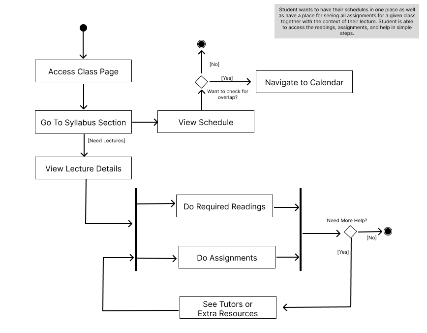
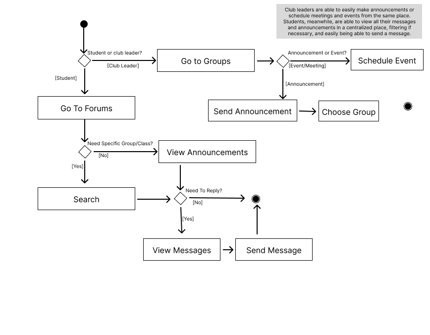
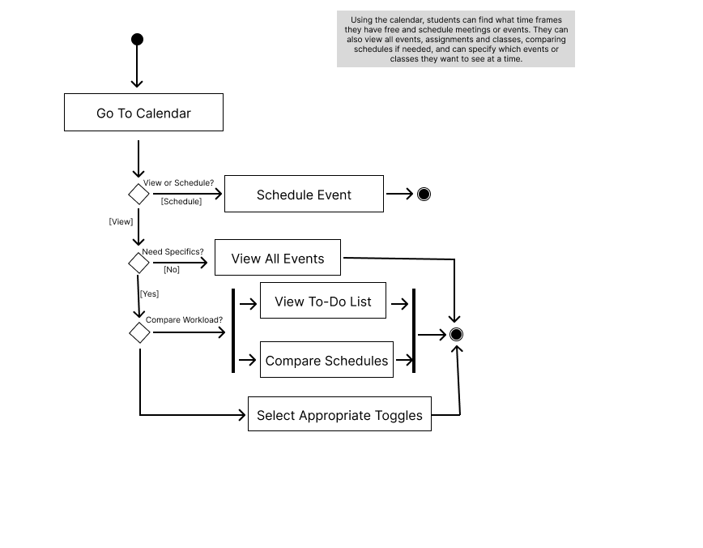

# Product Name: Brain Base

## Team members

William Xie (wx2114, seeyeh on Github)
David Jimenez (drj8812)
Melanie Zhang (mz3138)
Nick Burwell (nsb8225)

## Stakeholders

Our Target End-Users are college students.

NYU Senior 1: The most important aspect of a study/class management app for them is for it to offer an easy way to visualize their schedule (including classes, assignments, exams, etc.) all in one place. They wished Brightspace was easier to use on the go and liked that it reminded you about assignments, but wished it offered a calendar view for them. They believe Brightspace is missing a place/way to easily connect with classmates and/or TAs to ask questions or discuss things went over in class. Finally, they would like if enrolling for courses was in the same app as where you view your classes and assignments, not in a separate app.

NYU Undegraduate Alumni & Current Undergrad Student: 

Interviewer: What parts of brightspace do you think are beneficial/helpful as a student? 

Student: Brightspace’s organization is its strongpoint. Having specific sections for the content, discussion, assignments, and etc… for a class makes it easier to 
access the information I need. 

Interviewer: Are there any parts that you feel don’t work or aren’t helpful at all? 

Student: There are a lot of aspects of brightspace that I never use or click on. Most of the stuff under the ‘More Tools’ tab and ‘Course Reports’ tab I have never really used while nyu has used brightspace. There has also been many times where classes I've taken have used another resource to submit assignments like Gradescope or event email. If brightspace had more extensive grading capabilities then professors wouldn't need to use multiple different sites to grade and collect assignments. 

Interviewer: What tool do you wish Brightspace had that would make your life as a student easier?

Student: Adding a tab specifically for the syllabus would make things much easier for me because that’s the piece of information for the class that I’ll be revisiting for the 
whole length of the course. 

Interviewer: What do you think is the most important part of a student platform like brightspace? 

Student: The most important thing that I would look for in a platform like brightspace is to have everything I can so that I can be successful. Here are 3 things I'd like to see improved upon
    * I would want the syllabus to be right there in a tab once I click on a class
    * I want assignments tab to be more utilized by the professors
    * I want a tab where you can access the professors availability and easily sign up for office hours without having to email them about setting a time 

## Product Vision Statement

Our product is a general centralized study and class management app meant to make it simple for students to go about their daily needs, offering an alternative to platforms such as Brightspace, Moodle, etc.

## User Requirements

1. As a student, I want to view my class times, assignments, and club events/activities all in one calendar view automatically as they are assigned so that I can stay organized with all my deadlines.
2. As a student, I want to access additional tutoring resources so that I can get help with difficult class topics.
3. As a student, I want to see in an organized manner the readings I have for a particular lecture, alongside the scheduled topics and homework so that I can find all my readings easily.
4. As a student, I want to access a lecture’s assigned readings/topics/homework on a calendar with the rest of my deadlines, so that I can easily switch between different classes during a study session and still see what I have to accomplish across classes by a particular date.
5. As a student, I want to discuss class topics with my peers and ask my professor/TAs questions so that I can get help with things I don’t understand.
6. As a student, I want to keep track of my homework/readings in a to-do list so that I know what has been done and still needs to be done.
7. As a student, I want to see the syllabi/schedule of any class at NYU (past and present) so that I can see if a class is one that I want to take now or in the future.
8. As a student, I want to access all of my grades and feedback in a centralized platform so I can easily keep track of my progress in all my classes.
9. As a student, I want to access all announcements from professors or clubs in an organized place so that I can stay on top of any changes and communications.
10. As a club leader, I want to have a central platform where I can manage meetings and post announcements for all to see.
11. As a student, I want to be able to easily be able to schedule office hours/ meetings with professors of TA’s so that I don’t have to go through the process of emailing them and them potentially not seeing my email. 
12. As a student, I want a syllabus tab for each of my class's homepages so that I can have easy and quick access to my syllabus as the semester progresses 

## Activity Diagrams

As a student, I want to access additional tutoring resources so that I can get help with difficult class topics.

As a student, I want to see in an organized manner the readings I have for a particular lecture, alongside the scheduled topics and homework so that I can find all my readings easily.

As a student, I want a syllabus tab for each of my class's homepages so that I can have easy and quick access to my syllabus as the semester progresses.

As a student, I want to discuss class topics with my peers and ask my professor/TAs questions so that I can get help with things I don’t understand.

As a student, I want to access all announcements from professors or clubs in an organized place so that I can stay on top of any changes and communications.

As a club leader, I want to have a central platform where I can manage meetings and post announcements for all to see.

As a student, I want to view my class times, assignments, and club events/activities all in one calendar view automatically as they are assigned so that I can stay organized with all my deadlines.

As a student, I want to access a lecture’s assigned readings/topics/homework on a calendar with the rest of my deadlines, so that I can easily switch between different classes during a study session and still see what I have to accomplish across classes by a particular date.

As a student, I want to keep track of my homework/readings in a to-do list so that I know what has been done and still needs to be done.

As a student, I want to be able to easily be able to schedule office hours/ meetings with professors of TA’s so that I don’t have to go through the process of emailing them and them potentially not seeing my email. 

## Clickable Prototype

https://www.figma.com/design/NJdgNtX4NIFOI2PkgeRKCq/Wireframe-Diagram---Wahoo?node-id=0-1&t=YuI2FdlJvQrAZUMQ-1
