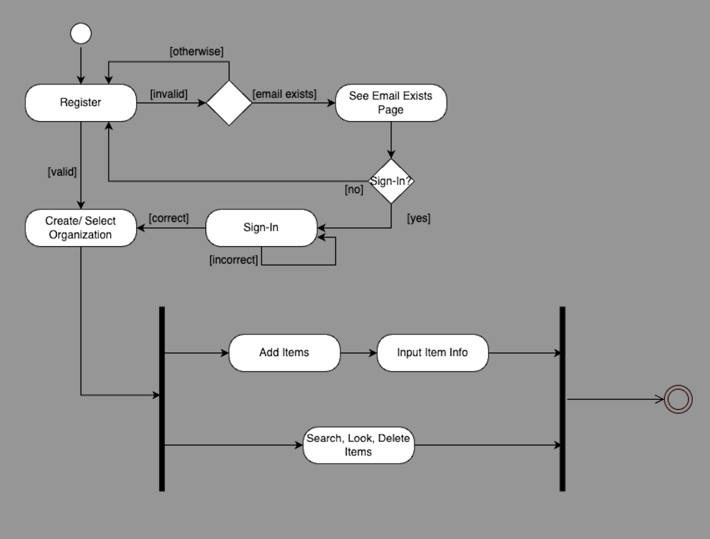

# Specification Phase Exercise

A little exercise to get started with the specification phase of the software development lifecycle. See the [instructions](instructions.md) for more detail.

## Team members

[Lucia Song](https://github.com/lys7942)  
[Wenli Shi](https://github.com/WenliShi2332)  
[Chelsea Hodgson](https://github.com/Chelsea-Hodgson)  
[Yeshni Savadatti](https://github.com/yeshnii)  

## Stakeholders
The interviewed stakeholder are Michael Salvati, Justin Engstler,Jackson Reynolds, and Landen Messner.(NYU Physic Lab Faculty Members)

 ### Features of the Lab Inventory Management App:

1. **Easy Equipment Location Tracking**: Users can quickly find the location of lab equipment. For example, they can see that "Item A is on shelf B in room C," making it easy to locate items in the lab.

2. **Item Addition Interface**: Users can easily add new items to the inventory through a dedicated 'Add Items' page. They can input the item’s name, room, shelf location, upload an image(optional) for reference, and specify the stock amount. This intuitive interface streamlines the process of updating inventory and ensures accurate item tracking.

3. **Real-time Equipment Status Monitoring**: Users can track the current status of lab equipment through the app. For example, they can see that "Item A has 3 available, 4 in use, and 2 broken," allowing for better resource planning.

4. **User and Admin Management**: The admin of an organization can invite other users to join the lab system. Once invited, all users can sync, update, and access real-time information about lab equipment. For example, Lab Manager A can invite Lab Technician B to join the same organization (e.g., NYU Lab Equipment System).

5. **Automated Checking Lists for Borrowing and Returning Equipment**: Each user has a personalized checking list where they log the quantity of items borrowed and update the item’s status to “in use.” The system automatically generates a new checking list for the user. When items need to be returned, the checking list helps users quickly and efficiently return the items to their correct locations.
6. **Inventory Alerts for Damaged Items**: When any item is marked as Broken, the app alerts lab administrators, making it easier to address the issue and manage repairs or replacements in a timely manner.

### Possible Problems and Pain Points:

1. **Disorganized equipment and supply management**: Lab staff may struggle to keep track of which equipment is in use, available, or whether they have enough supplies in stock.

2. **Unclear borrowing and return processes**: Staff may forget to return borrowed equipment or may not know if equipment was returned to the correct location.

3. **Unclear equipment status**: It can be difficult to know whether equipment is operational, needs repair, or should be replaced due to lack of timely updates.

4. **Time-consuming inventory checks**: Manually checking inventory can be time-consuming and prone to errors.

5. **Difficulty accessing information about items**: Lab staff may need to spend time finding equipment manuals, operational guides, or other relevant information.

## Product Vision Statement

Our Lab Inventory Management App empowers NYU Physics Lab faculty (or other Labs) to efficiently track, manage, and maintain lab equipment, ensuring streamlined operations, real-time equipment status updates, and simplified borrowing and returning processes, reducing errors and improving resource availability. 

## User Requirements

As a lab worker, I want to sign up so that I can organize and keep track of my lab equipment.  
As a business owner, I want to sign up so that I can keep track of the business's inventory in the storage warehouse.  
As a grocery store/ supermarket owner, I want to sign up so that I can see the locations of the items I am selling.  
As a lab user, I want to sign up so that I can see where all the equipment is and where to return it.  

For All:  
&nbsp;&nbsp;&nbsp;&nbsp;Estimation of Effort: M  
&nbsp;&nbsp;&nbsp;&nbsp;Acceptance Criteria:  
&nbsp;&nbsp;&nbsp;&nbsp;&nbsp;&nbsp;&nbsp;&nbsp;1. Customer username is captured and saved.  
&nbsp;&nbsp;&nbsp;&nbsp;&nbsp;&nbsp;&nbsp;&nbsp;2. Customer password is captured and saved.  
&nbsp;&nbsp;&nbsp;&nbsp;&nbsp;&nbsp;&nbsp;&nbsp;3. Customer email is capture and saved.  
&nbsp;&nbsp;&nbsp;&nbsp;&nbsp;&nbsp;&nbsp;&nbsp;4. Invalid usernames, emails, and password will be rejected.  
&nbsp;&nbsp;&nbsp;&nbsp;&nbsp;&nbsp;&nbsp;&nbsp;5. Customer signs in immediately after registration.  

## Activity Diagrams

As a lab worker, I want to sign up so that I can organize and keep track of my lab equipment:

As a business owner, I want to sign up so that I can keep track of the business's inventory in the storage warehouse:

## Clickable Prototype

See instructions. Delete this line and place a publicly-accessible link to your clickable prototype here.
